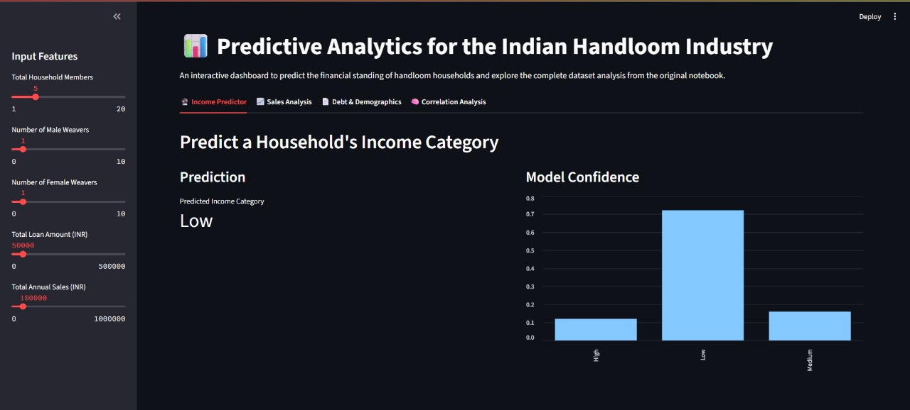
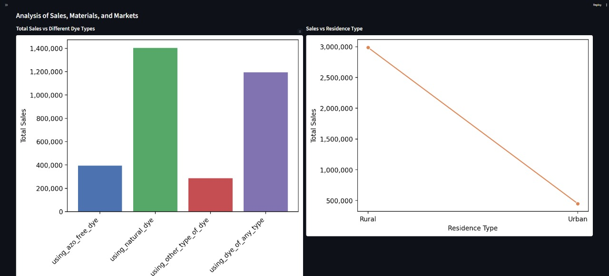
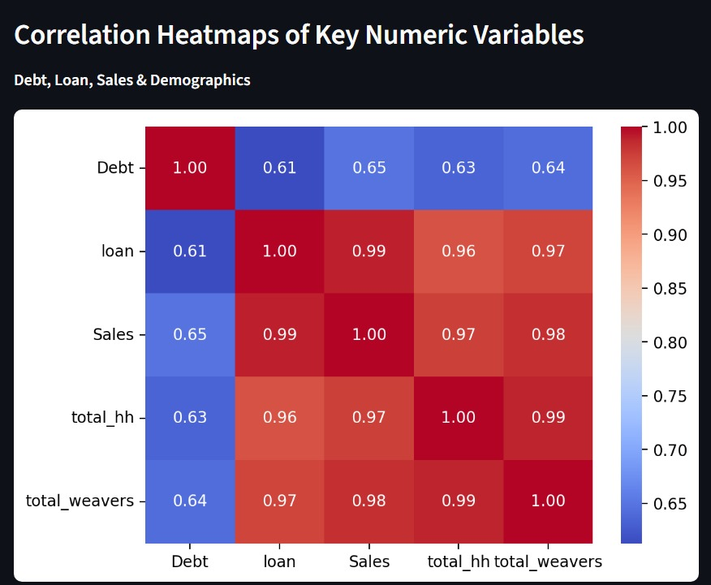

# 📊 Predictive Analytics for the Indian Handloom Industry

A decision support tool designed to analyze socio-economic patterns and forecast financial outcomes for artisan communities in the Indian handloom sector.

This project delves into the socio-economic landscape of the Indian handloom sector by analyzing comprehensive data on artisan communities. The handloom industry is a vital part of India's cultural heritage and rural economy, yet many artisans face financial instability.

The goal of this project is to transform raw data into a powerful decision support tool. By leveraging data analysis and predictive modeling, this tool aims to:
-   Identify key patterns in debt, income, and sales across various artisan communities.
-   Forecast potential financial outcomes based on factors like yarn type, dye used, and market location.
-   Provide actionable insights to guide socio-economic policy and support interventions in rural textile regions.

---

## ✨ Key Visual Insights

The analysis revealed several key trends in the handloom sector. Here are the most significant findings:

### 1. Weaver Income Distribution
The majority of weaver households fall into the lower income brackets, highlighting the need for economic support and intervention.



### 2. Impact of Materials and Key Correlations
The choice of materials directly impacts sales, while a correlation analysis reveals the underlying relationships between key financial factors.

<p float="left">
  
  
</p>

---

## 🛠️ Tech Stack
-   **Language:** Python
-   **Libraries:** Pandas, Scikit-learn (RandomForest, GridSearchCV), Streamlit, Matplotlib, Seaborn

---

## 🚀 Getting Started

To explore the full interactive dashboard on your own machine:

### Prerequisites
-   Python 3.8 or higher
-   `pip` package manager

### Installation & Launch
1.  **Clone the repository**
    ```sh
    git clone [https://github.com/](https://github.com/)[Your-GitHub-Username]/Handloom-Analytics.git
    ```
2.  **Navigate to the project directory**
    ```sh
    cd Handloom-Analytics
    ```
3.  **Install the required packages**
    ```sh
    pip install -r requirements.txt
    ```
4.  **Train the predictive model**
    ```sh
    python -m src.model_training
    ```
5.  **Run the Streamlit app**
    ```sh
    streamlit run src.app.py
    ```

The application will then open in your web browser.
